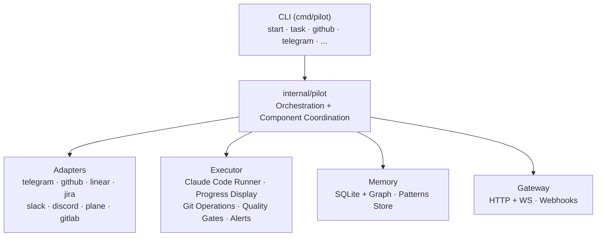
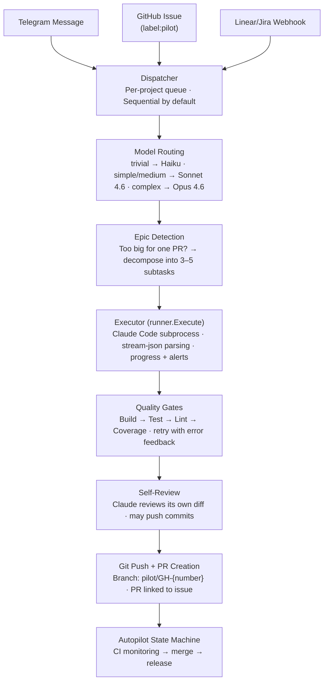
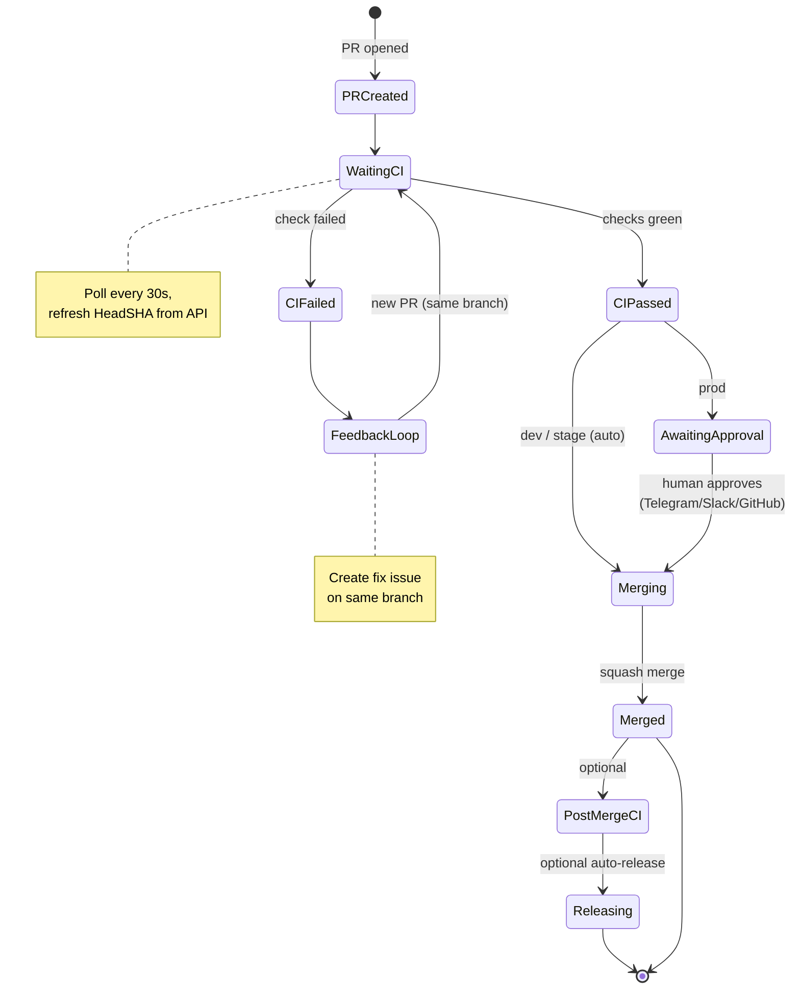
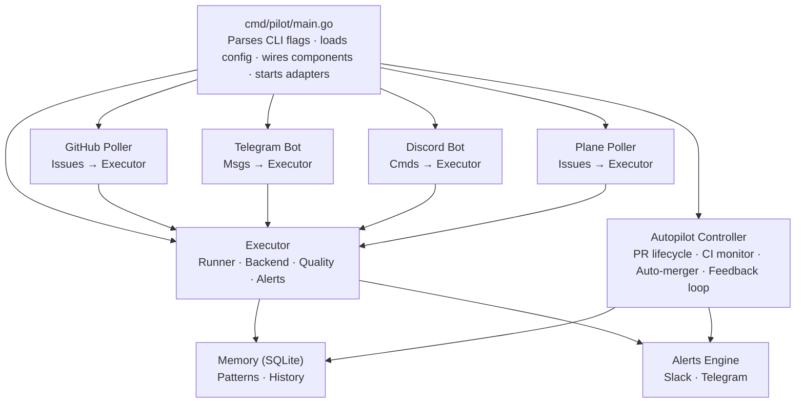
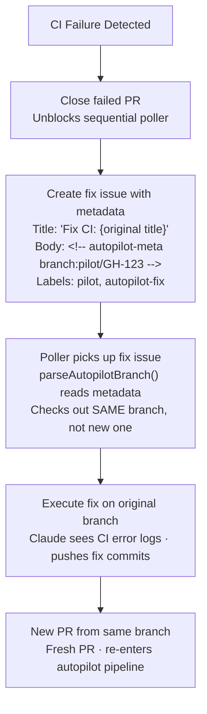

import { Callout } from 'nextra/components'

# Architecture & Execution Flow

Pilot is a Go-based autonomous development pipeline. This page covers the system architecture, the full execution flow from issue to merged PR, component interactions, and the autopilot state machine.

## High-Level Architecture



**37 packages** across four layers:

| Layer | Packages | Role |
|-------|----------|------|
| **Core** | `pilot`, `executor`, `config`, `memory`, `logging`, `alerts`, `quality`, `dashboard`, `briefs`, `replay`, `upgrade` | Execution engine, state, observability |
| **Adapters** | `telegram`, `github`, `slack`, `linear`, `jira`, `discord`, `plane`, `gitlab`, `azure-devops`, `asana` | Input sources and notification channels |
| **Supporting** | `gateway`, `orchestrator`, `approval`, `budget`, `teams`, `tunnel`, `webhooks`, `health` | Infrastructure, cost control, permissions |
| **Test** | `testutil` | Fake tokens, test helpers |

## Execution Flow: Issue → PR

This is the primary data flow — the path a GitHub issue takes from creation to merged PR. For the step-by-step runtime walkthrough with Navigator/non-Navigator/LocalMode callouts, see [Execution Pipeline](./execution-pipeline).



### Step-by-Step Walkthrough

**1. Input Ingestion**

Issues enter Pilot through five channels:

- **GitHub Poller** — Polls every 30 seconds for open issues labeled `pilot`. The primary production intake.
- **Telegram Bot** — Messages classified by intent (task, question, research, plan, chat). Tasks become issues.
- **Discord Bot** — Listens for commands in configured channels. Tasks are created as GitHub issues.
- **Plane Poller** — Polls Plane project boards for issues assigned to the Pilot actor.
- **Webhooks** — Linear, Jira, and GitHub webhook events via the Gateway HTTP server.

**2. Dispatcher Serialization**

The Dispatcher (`internal/executor/dispatcher.go`) maintains a per-project task queue. In `sequential` mode (default), only one task runs per project at a time. This prevents merge conflicts and ensures each PR is based on the latest `main`.

```go
// Per-project serialization prevents conflicts
dispatcher.Enqueue(projectPath, task)
// Next task starts only after current PR merges
```

**3. Complexity Detection & Model Routing**

Before execution, Pilot classifies the task:

| Complexity | Model | Timeout | Cost Range |
|------------|-------|---------|------------|
| Trivial | Haiku | 5m | ~$0.02 |
| Simple | Sonnet 4.6 | 15m | ~$0.20 |
| Medium | Sonnet 4.6 | 30m | ~$0.75 |
| Complex | Opus 4.6 | 60m | ~$3.00 |

Trivial tasks skip context intelligence entirely. Simple through complex tasks get full codebase context.

**4. Epic Decomposition**

If the task is too large for a single PR, the epic detector triggers. Detection uses structural signals — phase headers, checkboxes, word count above 100 — not just keyword matching.

When triggered, Pilot:
1. Sends the issue to Claude for planning
2. Parses the response into 3–5 sequential subtasks
3. Creates child issues, each labeled `pilot`
4. Marks the parent issue as `pilot-in-progress`
5. Subtasks are picked up by the poller sequentially

**5. Execution (Claude Code Subprocess)**

The executor spawns Claude Code as a subprocess:

```go
cmd := exec.Command("claude",
    "-p", prompt,
    "--verbose",
    "--output-format", "stream-json",
    "--dangerously-skip-permissions",
)
```

Output is parsed as `stream-json` events:
- `system` — initialization, session info
- `assistant` — Claude's text responses
- `tool_use` — tool invocations (Read, Write, Bash, Grep, etc.)
- `tool_result` — tool outputs
- `result` — final outcome with token counts

Progress is tracked through phase detection keywords in the output stream:

```
Navigator Session Started → navigator
TASK MODE ACTIVATED       → task-mode
PHASE: → RESEARCH         → research
PHASE: → IMPL             → implementing
PHASE: → VERIFY           → verifying
```

**6. Quality Gates**

After Claude Code completes, quality gates run in sequence:

| Gate | Default Timeout | Purpose |
|------|----------------|---------|
| `build` | 5m | Compilation check |
| `test` | 10m | Unit/integration tests |
| `lint` | 5m | Code style enforcement |
| `coverage` | 5m | Coverage threshold |
| `security` | 5m | Security scanning |
| `typecheck` | 5m | Type checking |

Each gate supports retries with configurable delay. On failure, the error output is fed back to Claude for automatic correction. Gate detection is automatic — Pilot infers build commands from the project type (Go, Node, Rust, Python).

**7. Self-Review**

Claude reviews its own diff before pushing. This catches issues that quality gates miss: naming inconsistencies, dead code, missing error handling. Self-review may push additional commits, which is why the commit SHA is refreshed from the GitHub API after PR creation.

**8. PR Creation**

Pilot pushes the branch (`pilot/GH-{issue_number}`) and creates a PR via the GitHub API. The PR body references the original issue and includes execution metadata.

## Autopilot State Machine

Once a PR exists, the autopilot controller manages its lifecycle through 10 stages:



### Stage Definitions

| Stage | Description | Next |
|-------|-------------|------|
| `pr_created` | PR exists, entering pipeline | `waiting_ci` |
| `waiting_ci` | Polling CI status every 30s | `ci_passed` or `ci_failed` |
| `ci_passed` | All required checks green | `merging` (dev/stage) or `awaiting_approval` (prod) |
| `ci_failed` | CI check failed | Feedback loop → new PR on same branch |
| `awaiting_approval` | Prod mode: waiting for human | `merging` on approval |
| `merging` | Squash merge in progress | `merged` |
| `merged` | PR merged to main | `post_merge_ci` or done |
| `post_merge_ci` | Waiting for main branch CI | `releasing` or done |
| `releasing` | Creating GitHub release | Done |
| `failed` | Terminal state, requires intervention | — |

### Environment Modes

| Environment | Auto-Merge | Approval | CI Wait | Use Case |
|-------------|------------|----------|---------|----------|
| `dev` | Yes | None | 5m timeout | Personal projects, fast iteration |
| `stage` | Yes | None | 30m timeout | Team staging, balanced safety |
| `prod` | No | Required | 30m timeout | Production, maximum control |

### Safety Controls

- **Circuit breaker**: Pauses after `max_failures` consecutive failures (default: 3)
- **Merge rate limit**: `max_merges_per_hour` prevents runaway automation (default: 10)
- **Approval timeout**: Prod mode times out after 1 hour without approval
- **Budget limits**: Per-task and daily spending caps with warn/pause/stop actions

## Component Interaction Diagram



### Data Flow Through Key Structs

```
Task (input)                    ExecutionResult (output)
├─ Title, Body                  ├─ Success bool
├─ ProjectPath                  ├─ CommitSHA
├─ BranchName                   ├─ BranchName
├─ IssueNumber                  ├─ PRNumber, PRURL
├─ Images []string              ├─ TokensIn, TokensOut
└─ Labels []string              ├─ Cost
                                └─ Duration

     │                               │
     │    runner.Execute()           │
     └──────────────────────────────▶│
                                     │
                                     ▼
                              PRState (autopilot)
                              ├─ PRNumber
                              ├─ HeadSHA (refreshed from API)
                              ├─ BranchName
                              ├─ Stage (PRStage enum)
                              ├─ CIStatus
                              └─ MergeAttempts
```

## Context Intelligence

Pilot's context intelligence layer provides structured codebase context. When Pilot detects a `.agent/` directory in the project, it activates the context engine by injecting a session initialization command into the prompt.

```
Pilot Prompt Construction:
┌────────────────────────┐
│ System instructions    │ ← Model routing, task constraints
├────────────────────────┤
│ Issue title + body     │ ← The actual work to do
├────────────────────────┤
│ "Start my Navigator    │ ← Activates context engine
│  session."             │
├────────────────────────┤
│ Branch + PR metadata   │ ← Git context
├────────────────────────┤
│ Budget constraints     │ ← Token/cost limits
└────────────────────────┘
```

Context engine phases detected in the execution stream:

| Phase | Signal | Description |
|-------|--------|-------------|
| `navigator` | `Navigator Session Started` | Context engine loaded, docs indexed |
| `task-mode` | `TASK MODE ACTIVATED` | Task planning begins |
| `research` | `PHASE: → RESEARCH` | Codebase exploration |
| `implementing` | `PHASE: → IMPL` | Writing code |
| `verifying` | `PHASE: → VERIFY` | Running tests, checking output |
| `complete` | Completion signal | Task finished |

<Callout type="warning">
Context intelligence is Pilot's core value proposition. The prompt injection (`Start my Navigator session.`) must never be removed — it's what gives Pilot deep codebase understanding rather than generic code generation.
</Callout>

## CI Feedback Loop

When CI fails on a Pilot PR, the feedback loop activates:



The branch metadata comment (`<!-- autopilot-meta branch:X -->`) ensures the fix happens on the original branch rather than creating a new one.

## Budget Enforcement

Budget limits are enforced at two levels:

| Level | Limits | Action on Exceed |
|-------|--------|-----------------|
| **Per-task** | Token count, duration | Stop current execution |
| **Daily/Monthly** | USD spending cap | Warn at 80%, pause new tasks, or stop all |

Actions escalate through three levels:
- `warn` — Notify but continue execution
- `pause` — Finish current task, block new ones
- `stop` — Terminate immediately

Budget status is checked before each task dispatch and during execution via the alert bridge.

## Configuration Hierarchy

```yaml
# ~/.pilot/config.yaml
gateway:           # HTTP + WebSocket server binding
adapters:          # Input sources (telegram, github, slack, linear, jira, discord, plane)
  github:
    polling:
      interval: 30s
      label: "pilot"
  discord:
    bot_token: ""
    guild_id: ""
    channel_ids: []
  plane:
    api_url: ""
    api_token: ""
    project_board: ""
orchestrator:      # Execution mode, autopilot config
  execution_mode: sequential    # sequential | parallel | auto
  autopilot:
    environment: stage          # dev | stage | prod
    auto_merge: true
    ci_poll_interval: 30s
    max_failures: 3             # Circuit breaker threshold
executor:          # Backend, model routing, decomposition
  backend: claude-code
  model_routing:
    trivial: claude-haiku-4-5-20251001
    simple: claude-sonnet-4-6
    medium: claude-sonnet-4-6
    complex: claude-opus-4-6
memory:            # SQLite persistence
quality:           # Gate configuration (build, test, lint, coverage)
alerts:            # Event routing to notification channels
budget:            # Cost controls and limits
projects:          # Multi-project configuration
```

## Database Schema

Pilot persists execution history and learned patterns in SQLite (WAL mode for concurrency):

```sql
-- Task execution history
executions (id, task_id, project_path, status, started_at,
            completed_at, duration_ms, output, error, commit_sha, pr_url)

-- Cross-project patterns (learned behaviors)
cross_patterns (id, title, description, type, scope,
                confidence, occurrences, is_anti_pattern)

-- Task queue for dispatcher serialization
task_queue (id, project_path, task_json, status,
            created_at, started_at, completed_at)
```

## What's Next

This architecture supports the following planned documentation pages:

- **[Model Routing](/concepts/model-routing)** — Deep dive into complexity classification and model selection
- **[Security Model](/concepts/security)** — Sandbox mode, webhook validation, token handling, trust boundaries
