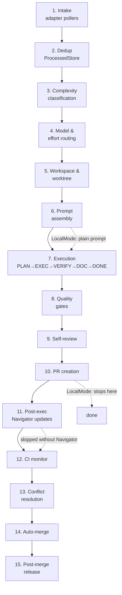

import { Callout } from 'nextra/components'

# Execution Pipeline

This page walks through Pilot's full runtime — from the moment an issue
is picked up by an adapter to the moment a release is cut from the
merged PR. It is the canonical reference for *what Pilot actually does*
once a ticket lands in its queue.

Pilot runs in two cooperating modes:

- **Navigator-integrated** — when the project has an `.agent/` directory,
  Pilot injects Navigator's planning, knowledge-graph, and DOCUMENT
  phases into execution. This is the default for repositories that opt
  in to Navigator.
- **Plain** — when no `.agent/` directory is present (and auto-init is
  off), Pilot runs a flatter execute-then-verify shape without
  Navigator's phase contract.

A third path, **LocalMode** (`pilot --local`), bypasses GitHub PR
creation entirely and runs as a one-shot problem solver against the
working tree. LocalMode disables Navigator auto-init, label gating, and
the autopilot tail of the pipeline.

Each step below has a stable anchor (`#1-intake` … `#15-post-merge-release`)
so other pages can deep-link to a specific phase.

## 1. Intake [#1-intake]

Pilot ingests work through adapter pollers and webhooks. Pickup is
gated on labels so the same repo can host both human and Pilot work.

- **GitHub poller**: 30-second interval by default. Picks up any open
  issue carrying the `pilot` label.
- **Linear, Jira, Asana, Azure DevOps**: poll their respective
  backlogs/boards on configurable intervals.
- **Telegram and Discord**: act as lower-latency intake channels —
  inbound messages are translated into GitHub issues before joining the
  pipeline.

**Label gate**:

| Label | Effect |
|---|---|
| `pilot` | Eligible for pickup |
| `pilot-in-progress` | Currently executing — skip |
| `pilot-failed` | Halted after retries — skip until cleared |
| `pilot-done` | Completed — skip |
| `pilot-retry-1`, `pilot-retry-2`, `pilot-retry-exhausted` | Persistent retry counter |

**Knobs**: `adapters.github.polling.interval`, `adapters.github.polling.label`,
multi-repo polling via `projects:` config block.

<Callout type="info">
**LocalMode**: skips intake entirely — the task is supplied directly on
the CLI. No label gating, no poller, no ProcessedStore lookup.
</Callout>

## 2. Deduplication (ProcessedStore) [#2-deduplication]

Each adapter writes picked-up issues into a SQLite-backed
`ProcessedStore` so a daemon restart does not reprocess the same
ticket. The poller checks ProcessedStore *before* executing — a hit
means the issue has already been seen and is skipped, even if its labels
still suggest pickup.

The store keeps a row per `(adapter, issue_id)` pair in
`~/.pilot/data/pilot.db`. There are no user-facing knobs; the table is
rebuilt automatically on first run.

**Failure mode** — if an issue is correctly labeled but Pilot will not
pick it up, ProcessedStore is the most common cause. The "Pilot won't
pick issue" runbook checks this table first, before investigating
config or code.

<Callout type="info">
**LocalMode**: ProcessedStore is bypassed — every CLI invocation is a
fresh run.
</Callout>

## 3. Complexity classification [#3-complexity-classification]

Before routing a model, Pilot asks a fast Haiku-based classifier to
score the task as **trivial**, **simple**, **medium**, or **complex**.
The score drives two downstream decisions:

1. Which model to route to in the next step.
2. Whether to engage Navigator at all. Trivial tasks (typos, version
   bumps, single-line config changes) skip Navigator entirely to avoid
   spending Opus tokens loading `.agent/` context for work that does
   not need it (originating issue: GH-216).

**Knobs**:

- `executor.complexity.*` — classifier model and threshold tuning.
- `claude_code.disable_navigator_for_epic` — force-skip Navigator on
  oversized epics that would otherwise OOM (GH-2332).

<Callout type="warning">
Do **not** set `CLAUDE_CODE_EFFORT_LEVEL` in the environment. It
short-circuits the classifier and the routing tier below it, pinning
every task to the same effort level.
</Callout>

## 4. Model & effort routing [#4-model-effort-routing]

Routing is two-tiered. A planning model produces the high-level plan,
then an execution model carries out each step.

| Tier | Default | Configured at |
|---|---|---|
| Planning | Opus 4.6 | `planning.model` |
| Execution — simple | Sonnet 4.6 | `model_routing.simple` |
| Execution — medium | Sonnet 4.6 | `model_routing.medium` |
| Execution — complex | Opus 4.6 | `model_routing.complex` |
| Execution — trivial | Haiku 4.5 | `model_routing.trivial` |

The classifier output from step 3 selects which `model_routing.*` key
applies. Effort level (reasoning depth) is derived from the same tier.

For the full routing matrix, retry behavior, and provider-specific
caveats, see [Model Routing](./model-routing).

## 5. Workspace & worktree setup [#5-workspace-worktree-setup]

Pilot isolates each task in its own git worktree (since v0.53.2). The
worktree allows a developer to keep uncommitted changes on `main`
without blocking Pilot from creating clean branches.

- **Branch name**: `pilot/GH-{issue_number}`.
- **Base**: latest `origin/main` (or configured default branch).
- **Failure**: any checkout failure is hard-fail — Pilot does not
  silently fall back to mutating the working tree (v0.34.0).

For setup details, parallel-worktree behavior, and cleanup, see
[Worktree Isolation](./worktree-isolation).

<Callout type="info">
**LocalMode**: no worktree, no branch — Pilot runs in the current
working directory and never pushes.
</Callout>

## 6. Prompt assembly [#6-prompt-assembly]

The prompt that goes to Claude Code (or another backend — see
[Execution Backends](./execution-backends)) is assembled differently
depending on which mode is active.

<Callout type="info">
**With Navigator** (the `.agent/` directory exists, mode is not
LocalMode, and the task was not flagged trivial-skip in step 3):

- Project context is injected by `loadProjectContext()` —
  `DEVELOPMENT-README.md` sections **Key Components**, **Key Files**,
  **Project Structure**, and **Current Version** are spliced into the
  prompt verbatim (originating issue: GH-1387).
- A `PILOT EXECUTION MODE` header instructs the agent to ignore any
  CLAUDE.md rules that forbid writing code or committing — those rules
  apply to interactive Navigator sessions, not Pilot executor runs.
- The prompt engages the `/nav-loop` contract: PLAN → EXECUTE →
  VERIFY → DOCUMENT → COMPLETE, with the agent expected to emit phase
  signals.
</Callout>

<Callout type="info">
**Without Navigator**: a plain task prompt with workflow instructions
only. No project context injection, no `/nav-loop` contract, no
DOCUMENT phase. The agent is told to make the change, run tests, and
commit.
</Callout>

<Callout type="info">
**LocalMode**: a problem-solving prompt — no PR constraints, no
Navigator, no PILOT EXECUTION MODE header, no commit/push expectation.
The agent's contract is "solve the problem in the working tree"
(GH-2103, GH-2108).
</Callout>

**Auto-init** — since v0.33.16, if `.agent/` is missing and
`executor.navigator.auto_init: true`, Pilot will scaffold the directory
from templates before assembling the prompt. Auto-init is suppressed in
LocalMode regardless of config (GH-2108).

## 7. Execution [#7-execution]

The agent runs the task. With Navigator engaged, this expands into the
five `/nav-loop` phases:

1. **PLAN** — sketch the change set, identify affected files.
2. **EXECUTE** — make edits, run iterative checks.
3. **VERIFY** — run tests/build locally inside the loop.
4. **DOCUMENT** — feature-matrix, knowledge-graph, decision comments
   (covered in step 11; originating issue: GH-1388).
5. **COMPLETE** — emit the structured exit signal.

Without Navigator the shape is flatter: execute, then verify. There is
no DOCUMENT phase.

**Stagnation monitor** (v0.56.0): Pilot hashes execution state on a
heartbeat. Repeated identical hashes escalate
**warn → pause → abort**, preventing runaway loops where the agent
edits the same file in circles. The cancel-on-result path lets a
backend stream a final result that immediately ends the run without
waiting for a heartbeat.

**Backends**: Codex Exec is the default; Claude Code, OpenCode, and
Qwen are supported. Backend selection affects timeouts and signal parsing — see
[Execution Backends](./execution-backends).

## 8. Quality gates [#8-quality-gates]

After the agent reports completion, Pilot runs configured quality
gates: tests, lint, build, coverage, security, typecheck. Each gate
supports retry with error-feedback — a failure is fed back to the agent
with the failing output so it can self-correct.

Self-review timeout is **backend-aware**: 10 minutes for OpenCode,
2 minutes otherwise. This avoids spuriously timing out OpenCode runs
while keeping Claude Code runs tight.

For gate types, configuration, and retry semantics, see
[Quality Gates](../features/quality-gates).

## 9. Self-review [#9-self-review]

Before opening a PR, the agent reviews its own diff. Self-review
catches problems gates do not see: dead code, naming inconsistencies,
missing error handling, scope creep.

**Self-review alignment** (v0.33.14): if the issue title names files
(e.g. `fix(api): handle nil in webhook.go`), self-review verifies that
those files were actually modified. A mismatch fails the review and
triggers a retry — preventing "ghost close" cases where the agent
declares done without touching the named code.

**Retry with `--resume`** (v1.1.0): when self-review fails, retries
re-enter the same Claude Code session via `--resume`, which preserves
prior context and saves roughly 40% of tokens versus a cold restart.

## 10. PR creation [#10-pr-creation]

Pilot pushes the worktree branch to origin and opens a pull request.

- **Title**: must be conventional (`type(scope): description`). The
  agent is constrained to produce one; if it does not, the PR is
  rejected and a retry is triggered.
- **Body**: links back to the source issue, includes execution
  metadata.
- **Rich PR comment**: Pilot follows up with a comment containing
  duration, token counts (in/out, cache read/write), and total cost.
- **Sub-issue wiring**: when the original issue was an epic
  decomposed into sub-issues, each sub-PR is wired back to the parent
  so the epic closes when the last child merges.

<Callout type="info">
**LocalMode**: the pipeline ends here — there is no push, no PR, no
autopilot tail. The agent's diff stays in the working tree for the
human to inspect.
</Callout>

## 11. Post-execution Navigator updates [#11-post-execution-navigator-updates]

This step runs **only in Navigator mode**. It corresponds to the
DOCUMENT phase of `/nav-loop` (originating issue: GH-1388).

- **Feature matrix update**: a row is added or updated in
  `.agent/system/FEATURE-MATRIX.md` with the current version and
  `Done` status.
- **`// Decision:` comments**: non-obvious architectural choices made
  during execution are captured inline in the source as
  `// Decision: …` comments so the *why* survives in the code.
- **Knowledge-graph enrichment**: execution learnings, patterns, and
  pitfalls are written into the project's knowledge graph for future
  Pilot runs to retrieve.
- **Index auto-sync** (originating issue: GH-57): the corresponding
  task entry in `DEVELOPMENT-README.md` is moved from the active
  section to **Completed**.

Without Navigator, this step is skipped entirely — the PR is opened
and the run hands off directly to step 12.

## 12. Autopilot CI monitor [#12-autopilot-ci-monitor]

Once the PR exists, the autopilot controller takes over and watches CI.

- **CI auto-discovery** (v0.41.0): required checks are detected from
  the PR's `statuses` and `check-runs` rather than configured by name,
  so adding a new GitHub Actions workflow does not require a Pilot
  config change.
- **Dynamic poll interval** (v1.8.5): Pilot backs off polling when CI
  is steady, polls aggressively near transitions.

For environment modes (`dev` / `stage` / `prod`), feedback loops, and
full state machine, see [Autopilot](../features/autopilot).

## 13. Conflict resolution [#13-conflict-resolution]

When `mergeable_state` reports `DIRTY` or `CONFLICTING`, autopilot
attempts an auto-rebase before falling back to a full re-execution.

- **API rebase first**: GitHub's "Update branch" endpoint is called.
  Trivial conflicts (upstream added unrelated files) resolve without
  re-running the agent.
- **Per-PR circuit breaker** (v0.34.0): if the same PR has already
  consumed its rebase budget, Pilot stops retrying and closes it
  with an explanatory comment, returning the issue to the queue.
- **Full re-execution fallback**: when rebase fails, the original
  issue is re-queued and re-implemented from a fresh branch off
  latest `main`.

**Knobs**: `autopilot.rebase.*` — enable/disable, per-PR retry budget.

## 14. Auto-merge [#14-auto-merge]

A PR is auto-merged when:

- CI is green on the head SHA.
- Self-review passed (or was bypassed by config).
- No blocking labels are present (`do-not-merge`,
  `awaiting-approval`, `pilot-failed`).
- The current autopilot environment permits auto-merge (`dev` and
  `stage` yes by default; `prod` requires approval).

Approval workflows — Telegram-driven, Slack-driven, or GitHub Review —
gate the merge in approval-required modes. See
[Approval Workflows](../features/approval-workflows) for the full
matrix.

## 15. Post-merge release [#15-post-merge-release]

Pilot's release pipeline is **tag-only**: pushing a `v*` tag triggers
GoReleaser in CI, which builds binaries and uploads them as release
assets. Pilot itself does not build release artifacts on the daemon
host.

When `autopilot.release.auto_release: true`, Pilot tags the merge
commit automatically; otherwise the maintainer pushes the tag manually.
The docs site picks up the new version via the
`<CurrentVersion/>` component bumped by the release workflow.

---

## Failure modes

<strong>Pilot won't pick an issue</strong>

Walk the checklist top to bottom — the cause is almost always above
the bottom rung.

1. Is the work already done? Check for an existing PR or branch.
2. Is a blocking label present? `pilot-in-progress`, `pilot-failed`,
   `pilot-done`.
3. Is the daemon running? `ps aux | grep pilot`.
4. Is the poller alive? Most recent `executions` row older than
   ~30 minutes suggests a silent poller stop.
5. Is the issue already in ProcessedStore?
   `SELECT * FROM adapter_processed WHERE adapter='github' AND issue_id='N'` —
   a present row makes the poller skip it.
6. Escape hatch: `pilot github run N --repo owner/repo` bypasses the
   daemon poller entirely.
7. Only then check config and code.

<strong>OOM on large epics</strong>

Loading the full Navigator context (`DEVELOPMENT-README.md` plus
indexed `.agent/` material) can blow the model's context window on
unusually large epics.

Mitigation: `claude_code.disable_navigator_for_epic: true` skips
Navigator engagement when the task is classified as an epic
(originating issue: GH-2332). The trade-off is no DOCUMENT phase and
no project-context injection for that run.

<strong>Navigator hijack in sandboxes</strong>

When running inside a sandboxed environment that already has its own
project shape, the Navigator auto-init step in step 6 can scaffold an
unwanted `.agent/` directory.

LocalMode takes priority over auto-init: passing `--local` suppresses
auto-init regardless of `executor.navigator.auto_init`
(originating issues: GH-2103, GH-2108). Use LocalMode for one-shot
runs in foreign trees.

---

## Operational knobs reference

| Key | Type | Step | Effect |
|---|---|---|---|
| `adapters.github.polling.interval` | config | 1 | GitHub poll cadence (default 30s) |
| `adapters.github.polling.label` | config | 1 | Pickup label (default `pilot`) |
| `pilot` | label | 1 | Marks issue as eligible for pickup |
| `pilot-in-progress` | label | 1 | Currently executing — skip |
| `pilot-failed` | label | 1 | Halted after retries — skip |
| `pilot-done` | label | 1 | Completed — skip |
| `pilot-retry-1` / `-2` / `-exhausted` | label | 1 | Persistent retry counter |
| `~/.pilot/data/pilot.db` | path | 2 | ProcessedStore database |
| `executor.complexity.*` | config | 3 | Complexity classifier tuning |
| `claude_code.disable_navigator_for_epic` | config | 3, 6 | Skip Navigator on epics (OOM mitigation) |
| `CLAUDE_CODE_EFFORT_LEVEL` | env | 3, 4 | **Do not set** — overrides routing |
| `planning.model` | config | 4 | Planning-tier model |
| `model_routing.{trivial,simple,medium,complex}` | config | 4 | Execution-tier model per complexity |
| `executor.navigator.auto_init` | config | 6 | Scaffold `.agent/` if missing |
| `--local` | CLI flag | 1, 6, 10 | LocalMode: skip intake, plain prompt, no PR |
| `executor.backend` | config | 7 | `claude-code` / `opencode` / `qwen` |
| `quality.gates.*` | config | 8 | Per-gate enable, command, retries |
| `autopilot.environment` | config | 12, 14 | `dev` / `stage` / `prod` |
| `autopilot.ci_poll_interval` | config | 12 | CI poll cadence |
| `autopilot.rebase.*` | config | 13 | Auto-rebase enable + per-PR budget |
| `autopilot.auto_merge` | config | 14 | Allow auto-merge in this environment |
| `autopilot.release.auto_release` | config | 15 | Tag the merge commit automatically |
