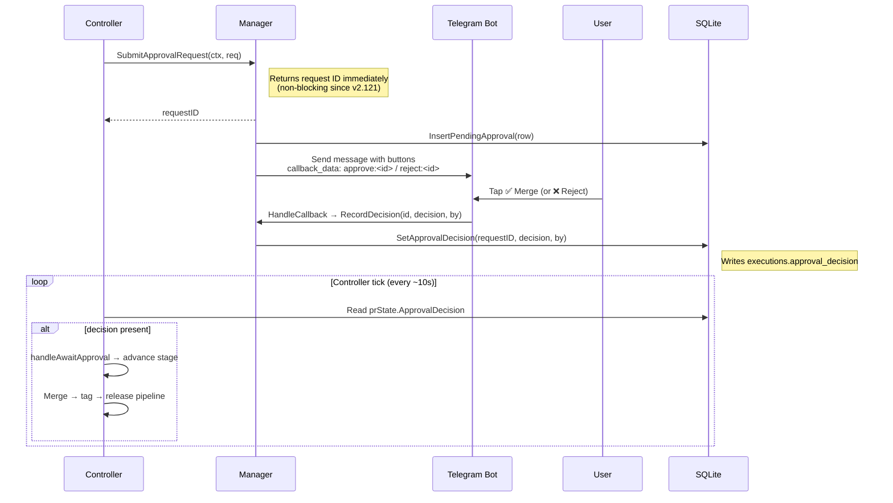

import { Callout, Tabs } from 'nextra/components'

# Approval Workflows

Human approval gates for autonomous task execution, PR merging, and failure recovery.

<Callout type="info">
  Approval workflows are designed for the autopilot `prod` environment where human oversight is required before code ships.
</Callout>

## Overview

Pilot supports optional approval checkpoints at three stages of the autonomous pipeline. When enabled, Pilot pauses execution and sends an approval request through your configured channel (Telegram, Slack, or GitHub PR reviews).

```
Task Received
  │
  ├─ pre_execution ──→ Approve? ──→ Execute Task
  │                         ↘ Reject → Skip Task
  │
  ├─ Task Executes → PR Created → CI Passes
  │
  ├─ pre_merge ──────→ Approve? ──→ Merge PR
  │                         ↘ Reject → Mark Failed
  │
  └─ (On Failure)
     post_failure ───→ Approve? ──→ Retry
                            ↘ Reject → Abort
```

## Stages

| Stage | When | Purpose |
|-------|------|---------|
| `pre_execution` | Before Pilot starts working on a task | Gate sensitive or high-risk work |
| `pre_merge` | After CI passes, before auto-merge | Final human review before shipping |
| `post_failure` | After task execution or CI fails | Approve retry or escalate |

### Decisions

Each approval request resolves to one of three outcomes:

| Decision | Effect |
|----------|--------|
| `approved` | Proceed to the next stage |
| `rejected` | Stop execution, mark task as failed |
| `timeout` | Apply `default_action` (configurable per stage) |

## Configuration

```yaml
# ~/.pilot/config.yaml
approval:
  enabled: true
  default_timeout: 1h
  default_action: rejected       # What happens on timeout: approved | rejected

  pre_execution:
    enabled: true
    timeout: 1h
    default_action: rejected
    approvers:
      - "@alice"
      - "@bob"
    require_all: false           # Any one approver is sufficient

  pre_merge:
    enabled: true
    timeout: 24h                 # Longer window for code review
    default_action: rejected
    approvers: []                # Empty = any configured channel user

  post_failure:
    enabled: false               # Disabled by default
    timeout: 1h
    default_action: rejected
    approvers: []
```

### Per-Stage Overrides

Each stage inherits from the top-level defaults and can override:

| Field | Default | Description |
|-------|---------|-------------|
| `enabled` | `true` | Enable this approval stage |
| `timeout` | `default_timeout` | How long to wait for a response |
| `default_action` | `default_action` | Action on timeout (`approved` or `rejected`) |
| `approvers` | `[]` | List of authorized approver handles |
| `require_all` | `false` | Require all approvers vs any one |

<Callout type="warning">
  Setting `default_action: approved` means tasks will auto-proceed if no one responds within the timeout. Use with caution.
</Callout>

## Timeout Behavior

When an approval request expires:

1. Pilot logs a warning with the request ID and task ID
2. The pending request is cancelled on the notification channel
3. The `default_action` for that stage is applied
4. If `default_action: rejected`, the task is marked as failed

**Timeout precedence** (highest to lowest):
1. Stage-specific `timeout` (e.g., `pre_merge.timeout: 24h`)
2. Global `default_timeout` (e.g., `approval.default_timeout: 1h`)
3. Built-in defaults: 1h for `pre_execution`/`post_failure`, 24h for `pre_merge`

## `require_all` Semantics

| Setting | Behavior |
|---------|----------|
| `require_all: false` (default) | First approver to respond decides |
| `require_all: true` | All listed approvers must approve |

When `require_all: true`, a single rejection from any approver rejects the request immediately. All approvers must explicitly approve for the request to proceed.

## Channels

Pilot sends approval requests through whichever channel is configured. If multiple channels are available, the first registered channel is used.

<Tabs items={['Telegram', 'Slack', 'GitHub PR Reviews']}>

### Telegram Inline Keyboard

Approval requests appear as messages with inline buttons:

```
🔔 Approval Required: pre_merge

Task: GH-123 — Add rate limiting
PR: #456

[✅ Merge]  [❌ Reject]
```

Button labels are stage-specific:

| Stage | Approve Button | Reject Button |
|-------|---------------|---------------|
| `pre_execution` | ✅ Execute | ❌ Cancel |
| `pre_merge` | ✅ Merge | ❌ Reject |
| `post_failure` | 🔄 Retry | ⏹ Abort |

After a decision, the message is edited to show the result. No setup beyond the standard [Telegram Bot](/features/telegram) configuration is needed.


### Slack Interactive Blocks

Approval requests are posted as rich messages with action buttons:

```
🔔 Approval Required: pre_merge
━━━━━━━━━━━━━━━━━━━━━━━━━━━━━━
Task: GH-123 — Add rate limiting
PR: https://github.com/you/repo/pull/456

[Approve]  [Reject]
```

Slack blocks include:
- Section block with task metadata and PR link
- Actions block with approve/reject buttons

Requires Slack interactive messages to be configured (see your Slack app's **Interactivity & Shortcuts** settings).


### GitHub PR Reviews

For the `pre_merge` stage, Pilot can use native GitHub PR reviews as the approval mechanism.

- **Approve**: Submit a PR review with "Approve"
- **Reject**: Submit a PR review with "Request changes"

Pilot polls for review status at a configurable interval (default: 30s). Webhook events (`pull_request_review.submitted`) provide instant response when configured.

```yaml
# GitHub approval is automatic when using --github flag
pilot start --github --env=prod
```

No additional configuration needed — Pilot monitors PR reviews on any PR it creates.

</Tabs>

## Autopilot Integration

Approval workflows integrate directly with the autopilot environment system:

| Environment | Approval Required | Behavior |
|-------------|------------------|----------|
| `dev` | No | Auto-merge after CI passes |
| `stage` | No | Auto-merge after CI + delay |
| `prod` | Yes (`pre_merge`) | Waits for human approval before merge |

### Production Flow

```
Task → Execute → PR → CI Passes → Await Approval → Merge
                                        ↓
                                   (timeout)
                                        ↓
                                  default_action
```

Start Pilot with approval-gated production mode:

```bash
pilot start --github --env=prod
```

When CI passes on a PR in `prod` mode:
1. Pilot transitions the PR to **Await Approval** state
2. An approval request is sent via your configured channel
3. Pilot blocks until approved, rejected, or timed out
4. On approval, the PR is merged. On rejection, the PR is marked as failed.

## How async approval works

Since v2.121.0, approval dispatch is non-blocking. The controller submits a request and
immediately returns, while the Telegram handler processes the user's tap independently.
The sequence below shows the full round-trip.



### Daemon-restart resilience

Pending approval requests survive a daemon restart:

- **v2.122**: `InsertPendingApproval` writes each request to the `approval_pending` SQLite table on dispatch.
- **v2.123**: On startup, `tgApprovalHandler.RehydratePending` loads all non-expired rows from `approval_pending` and re-registers them in the in-memory map.

A user can tap **Approve** minutes after a daemon restart and the callback lands correctly.

<Callout type="info">
  The `approval_pending` table is pruned automatically when requests expire or are decided. It is safe to inspect with `sqlite3 ~/.pilot/data/pilot.db "SELECT * FROM approval_pending"`.
</Callout>

## Disabling Approval

Approval is disabled by default. To explicitly skip it:

```yaml
approval:
  enabled: false
```

Individual stages can also be disabled while keeping the system active:

```yaml
approval:
  enabled: true
  pre_execution:
    enabled: false     # Skip pre-execution gate
  pre_merge:
    enabled: true      # Keep pre-merge gate
  post_failure:
    enabled: false     # Skip post-failure gate
```

When a stage is disabled or the approval system is off, Pilot auto-approves and proceeds without pausing.
