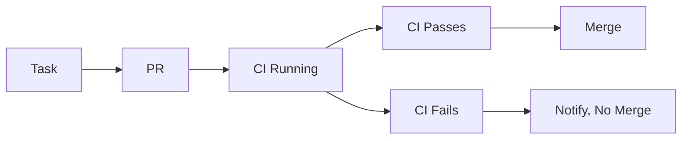
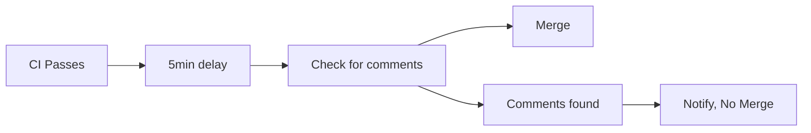
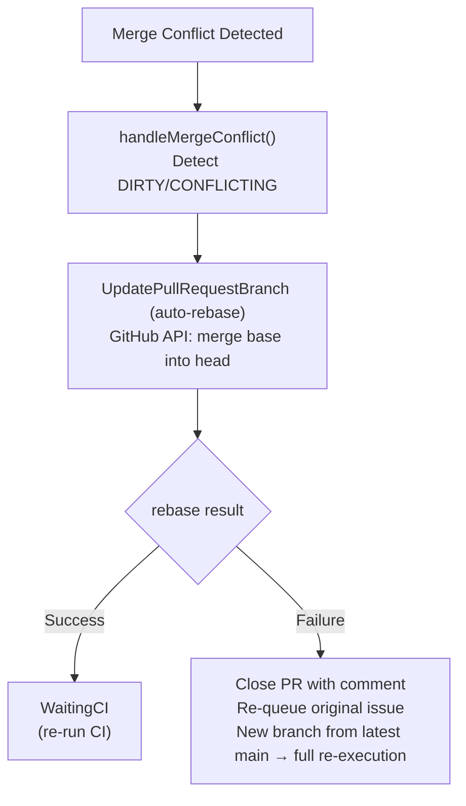

import { Callout } from 'nextra/components'

# Autopilot Mode

Fully autonomous operation with automatic PR merging. Autopilot is the post-execution tail of Pilot's [Execution Pipeline](/concepts/execution-pipeline) — it picks up once the PR is opened and runs CI monitoring, conflict resolution, auto-merge, and release.

<Callout type="error" emoji="🚨">
  Autopilot can merge code without human review. Use with caution.
</Callout>

## Environments

| Environment | Auto-merge | CI Required | Use Case |
|-------------|------------|-------------|----------|
| `dev` | After CI passes | Yes | Personal projects |
| `stage` | After CI + delay | Yes | Team staging |
| `prod` | Never | Yes | Production (review required) |

See [Autopilot Environments](/features/autopilot-environments) for detailed behavior differences, recommended configurations, and migration guides.

## Configuration

```yaml
# ~/.pilot/config.yaml
autopilot:
  enabled: true
  environment: stage
  auto_merge: true
  require_ci: true
  merge_delay: 5m  # Wait before merging (stage only)
  protected_branches:
    - main
    - production
```

## Usage

```bash
# Development - fast iteration
pilot start --github --env=dev

# Staging - with safety delay
pilot start --github --env=stage

# Production - no auto-merge
pilot start --github --env=prod
```

## Safety Features

### CI Requirement

Autopilot always waits for CI to pass:



### Merge Delay (Stage)

In `stage` mode, there's a configurable delay:



### Protected Branches

Direct pushes to protected branches are blocked. Autopilot always creates PRs.

## Monitoring

Track autopilot activity:

```bash
# View recent autopilot actions
pilot autopilot status

# Follow runtime logs
pilot logs --follow

# Dashboard with real-time updates
pilot start --github --env=dev --dashboard
```

## Rollback

If autopilot merges something problematic:

```bash
# Revert the last autopilot merge
pilot rollback --last

# Revert a specific PR
pilot rollback --pr 123
```

## Conflict Resolution

When a Pilot PR has a merge conflict, autopilot automatically attempts to resolve it via rebase before falling back to full re-execution. This is handled by `handleMergeConflict()` in the autopilot controller.

### Auto-Rebase Flow



### How Conflict Detection Works

Autopilot checks the PR's `mergeable_state` field from the GitHub API during each poll cycle. When the state is `DIRTY` or `CONFLICTING`, conflict resolution triggers automatically:

1. **First attempt — API rebase**: Calls GitHub's [Update a pull request branch](https://docs.github.com/en/rest/pulls/pulls#update-a-pull-request-branch) endpoint. This is equivalent to clicking the "Update branch" button on the PR page. It merges the base branch (typically `main`) into the PR's head branch.

2. **If rebase succeeds**: The PR transitions back to the `WaitingCI` stage. GitHub automatically triggers CI on the updated branch, and autopilot resumes monitoring from there.

3. **If rebase fails**: The conflict is non-trivial (e.g., both branches edited the same lines). Autopilot closes the PR with an explanatory comment describing the conflict, then returns the original issue to the execution queue. On re-execution, Pilot creates a fresh branch from the latest `main` and re-implements the changes from scratch.

### Cost Savings

Auto-rebase avoids ~$8–15 per full re-execution for conflicts that are trivially resolvable (e.g., upstream added a new file, or unrelated lines in the same file changed). In projects with frequent parallel PRs, this can save significant cost over a week of operation.

### Configuration

```yaml
# ~/.pilot/config.yaml
autopilot:
  enabled: true
  conflict_handling:
    auto_rebase: true        # Enable auto-rebase via GitHub API (default: true)
    close_on_failure: true   # Close PR if rebase fails (default: true)
    requeue_on_failure: true # Re-queue issue for fresh execution (default: true)
    max_rebase_attempts: 1   # Attempts before falling back to close (default: 1)
```

Set `auto_rebase: false` to skip the rebase attempt and immediately close-and-requeue on any conflict. This is useful if your CI is fast and re-execution is cheaper than debugging merge artifacts.

## CI Fix Dependencies

When autopilot's feedback loop creates a CI fix issue (after a CI failure), the fix issue body includes a `Depends on: #N` annotation linking it back to the original parent issue. This provides traceability between fix attempts and the tasks that triggered them.

### Dependency Annotations

The annotation is added to the fix issue body as a metadata line:

```markdown
Depends on: #142

CI failed on PR #145 (branch: pilot/GH-142).
Error: `test_login_redirect` assertion failure on line 47.

Fix the failing test while preserving the original feature behavior.
```

This lets you trace the chain: original issue → PR → CI failure → fix issue → fix PR. GitHub also renders `#142` as a clickable cross-reference, so the original issue shows all related fix attempts in its timeline.

## Stagnation Monitor

Detects stuck executions by tracking state changes and escalating through progressive intervention levels.

### How Detection Works

Each execution turn, Pilot hashes the current state using the pattern `phase:progress:iteration`. This creates a unique fingerprint for each distinct execution state.

- **History buffer**: Recent state hashes are stored (configurable size, default 5)
- **Repeat detection**: Consecutive identical hashes indicate the execution is stuck in a loop
- **Time-based detection**: No progress for extended periods also triggers escalation

When either condition is met, the monitor escalates through intervention levels.

### Escalation Levels

| Level | Trigger | Action |
|-------|---------|--------|
| None | Normal progress | Continue execution |
| Warn | 3+ identical states OR `warn_timeout` (10m) | Log warning, continue |
| Pause | `pause_at_iteration` (12) OR `pause_timeout` (20m) | Pause execution, attempt recovery |
| Abort | `abort_at_iteration` (15) OR `abort_timeout` (30m) | Stop execution, optionally commit partial work |

### Configuration

```yaml
# ~/.pilot/config.yaml
executor:
  stagnation:
    enabled: true
    warn_timeout: 10m              # Time without progress before warning
    pause_timeout: 20m             # Time without progress before pause
    abort_timeout: 30m             # Time without progress before abort
    warn_at_iteration: 8           # Iteration count to trigger warn
    pause_at_iteration: 12         # Iteration count to trigger pause
    abort_at_iteration: 15         # Iteration count to trigger abort
    state_history_size: 5          # Number of state hashes to track
    identical_states_threshold: 3  # Consecutive identical states for warn
    grace_period: 30s              # Ignore stagnation during startup
    commit_partial_work: true      # Save progress on abort
```

### Partial Work Commit

When `commit_partial_work: true` (default), Pilot salvages progress on abort:

- Commits whatever changes were made before stagnation
- Creates a PR with partial implementation
- Marks the issue as `pilot-failed` with stagnation reason
- Allows manual continuation from the partial branch

<Callout type="warning">
The stagnation monitor is disabled by default. Enable it for long-running tasks where stuck executions waste tokens. The default timeouts (10m/20m/30m) work well for most projects.
</Callout>

## Review Feedback

When a reviewer submits `CHANGES_REQUESTED` on a Pilot PR, autopilot automatically creates a revision issue, closes the original PR, and re-executes with the reviewer's feedback incorporated.

### How It Works

```
Reviewer submits CHANGES_REQUESTED
         │
         ▼
┌─────────────────────────────┐
│ Collect review comments     │
│ (top-level + line-level)    │
└────────┬────────────────────┘
         │
         ▼
┌─────────────────────────────┐
│ Learn from review           │ ← Pattern learning (pre-execution)
│ (confidence boost,          │
│  anti-pattern extraction)   │
└────────┬────────────────────┘
         │
         ▼
┌─────────────────────────────┐
│ Create revision issue       │ ← Formatted review comments in body
│ with iteration counter      │
└────────┬────────────────────┘
         │
         ▼
┌─────────────────────────────┐
│ Close original PR           │ ← Unblocks sequential poller
│ Clean up branch             │
└────────┬────────────────────┘
         │
         ▼
┌─────────────────────────────┐
│ Pilot picks up revision     │
│ issue → re-executes on      │
│ same branch with --from-pr  │
│ for session context         │
└─────────────────────────────┘
```

### Detection Modes

Review feedback works in both operational modes:

- **Webhook mode** (instant): The `OnPRReview` callback fires immediately when GitHub sends a `pull_request_review` event with `action: submitted` and `state: changes_requested`.
- **Polling mode** (periodic): During each `processAllPRs` tick, autopilot calls `hasChangesRequested()` to check for unresolved change requests. Bot reviews (self-review) are filtered out automatically.

### Configuration

```yaml
# ~/.pilot/config.yaml
autopilot:
  review_feedback:
    enabled: true
    max_iterations: 3  # Maximum revision cycles before giving up (default: 3)
```

### Safety Guards

| Guard | Description |
|-------|-------------|
| Iteration limit | Controlled by `max_iterations` (default: 3). After reaching the limit, the PR is closed and marked as failed. Prevents infinite review-fix cycles. |
| Self-review filter | Bot reviews (usernames containing `[bot]` or ending in `-bot`) are excluded from change-request detection. Pilot's own self-review won't trigger a revision loop. |
| Per-reviewer tracking | Only the latest review state per reviewer is considered. If a reviewer approves after previously requesting changes, the change request is resolved. |

<Callout type="info">
  The iteration limit reuses the same counter mechanism as CI fix iterations. Each revision issue body includes an `Autopilot-Iteration: N` marker that the controller parses to track the current cycle.
</Callout>
