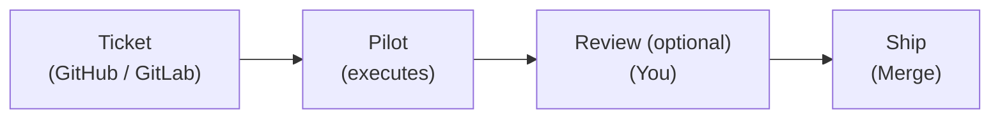

<Hero />

Pilot is an autonomous development pipeline with **260+ features** production-ready. It picks up tickets from GitHub Issues, GitLab Issues, Linear, Jira, Asana, Plane, or Discord — plans the implementation using your codebase context, writes code with Claude Code, runs quality gates, and opens a pull request. You review and merge.



No prompting. No babysitting. Label a ticket, get a PR or a release.

<HeroImage
  src="/pilot-preview.webp"
  alt="Pilot's dashboard — live token, cost and queue metrics, the task queue, autopilot status, architect findings, history, logs, and the Codex panel"
  width={1600}
  height={1000}
/>

---

## Quick Start

```bash
# Install
curl -fsSL https://raw.githubusercontent.com/ylcn91/pilot/main/install.sh | bash

# Configure
pilot setup

# Set your Git token (GitHub or GitLab)
export GITHUB_TOKEN="your-token"   # or GITLAB_TOKEN

# Start Pilot
pilot start --github --dashboard   # or --gitlab
```

Then label any issue with `pilot`. Pilot picks it up within 30 seconds.

Works with your **Claude subscription** (Pro/Max) or Anthropic API key. No separate API key required if you're already logged into Claude Code.

[Full getting started guide →](/getting-started/prerequisites)

---

## What Makes Pilot Different

### Ticket-driven, not prompt-driven

Other AI tools need you in the loop — typing prompts, reviewing suggestions, copy-pasting code. Pilot works from your existing ticket system. Write the ticket like you would for a junior developer. Pilot handles the rest.

### Context intelligence

Pilot's built-in context engine reduces token usage by 92% while following your architecture, patterns, and conventions. Strategic documentation loading gives Pilot deep codebase understanding — not generic code generation. [Learn more →](/navigator)

### Autopilot CI loop

Pilot doesn't stop at creating a PR. In autopilot mode, it monitors CI, auto-merges when tests pass, and automatically creates fix issues when CI fails — targeting the original branch for fast iteration. Three modes: `dev` (fast), `stage` (CI required), `prod` (human approval required).

### Self-hosted, self-updating

Single Go binary. Runs on your infrastructure. Your secrets never leave your environment. [Hot-upgrades](/features/hot-upgrade) itself without downtime — press `u` in the dashboard and the binary replaces itself in-place.

---

## Core Features

<FeatureGrid />

[Explore all features →](/features/autopilot)

---

## Who It's For

**Solo developers** — Handle your backlog of boring tickets while you build features. Wake up to PRs ready for review.

**Team leads** — Turn 47 tickets into 47 PRs. Review them like any team member's code. No new tool to learn — your team just labels issues.

**Organizations** — Codify engineering standards with context intelligence. Every PR follows your patterns, across every team. Self-hosted for security. PR review for control.

---

## Ideal Tasks

Pilot works best on well-defined, bounded work:

- CRUD endpoints and React components
- Test coverage for existing code
- Documentation and README updates
- Bug fixes with clear reproduction steps
- Dependency updates and security patches
- Database migrations with straightforward schema changes

Not for: architecture decisions, novel algorithms, or anything requiring engineering judgment. Pilot augments your team — it doesn't replace it.

---

## Open Development

Pilot is source-available under [BSL 1.1](https://github.com/ylcn91/pilot/blob/main/LICENSE). Free for internal use and self-hosting. Inspect the code, audit what it does, contribute improvements.

- [GitHub Repository](https://github.com/ylcn91/pilot)
- [Contributing Guide](https://github.com/ylcn91/pilot/blob/main/CONTRIBUTING.md)
- [Report an Issue](https://github.com/ylcn91/pilot/issues)
- Built by [QuantFlow Studio](https://quantflow.studio)
